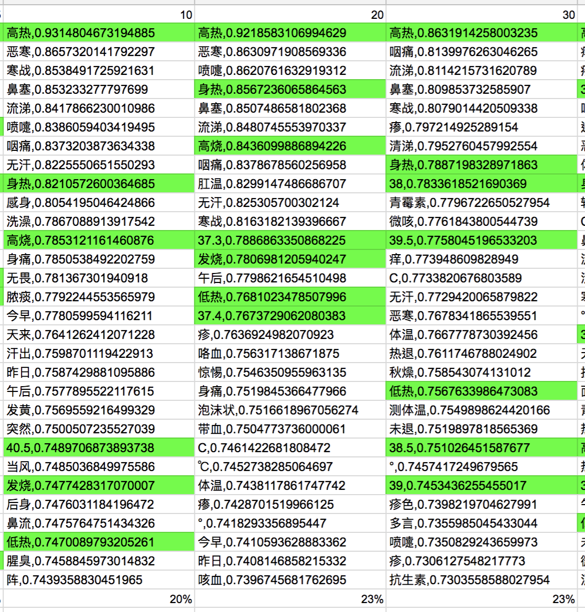

#  中醫醫案症狀詞之同義詞與相關詞的擷取

### 資料集
- 中醫醫案，共5,428筆，共4,231,852字。
- 純文字檔，非結構化資料。
- 字數
  - min : 48字
  - max : 29,373字
  - mean : 780字
- 案例
  - 「李某， 女， 67岁。 每于夏日洗澡后即寒 热不适，自感 发热而又需披衣裹 护。并于不知不 觉中汗透衣服，急又 换衣，如此三四次方 渐趋平复。年年如此，以至夏日 视洗澡为畏途。曾住院治 疗不 效。中医鉴于盛夏炎热，每以涤暑益气，敛汗固表为治，总不见效。三年前来我处就诊。症如前述 ， 脉虚大而迟， 苔薄黄。乃处桂枝汤加黄芪、炮附片，1剂效，2剂愈。后每年夏日发作，均来服药 2剂即愈。」
  
### 模型工具
- 演算法
  - Word Embedding
- 模型
  - Google Word2vec 
- 套件工具
  - gensim

### 實驗
- 斷詞
 - 以 jieba 進行斷詞 (1,728,353個詞) 
- 參數
  - dimension size : 300
  - window : {5,10,20,30,40,50,100}
- 輸入詞
  - 发热
- 輸出詞
  - 前 30名的相似詞

### 實驗結果
- 以”發熱”預測前三十名之相近詞的結果
- 評測
  - 輸入詞: 发热
  - 輸出詞: 前30名的相似詞，及其 similarity
- 人工評價
  - 可視為同義詞者標為綠色

### 結論
- window number 設為20時，擷取同義詞的效果最好，比例為 23%。
- **window number 設為5時，擷取相關症狀詞的效果最好，比例為 83%。**

